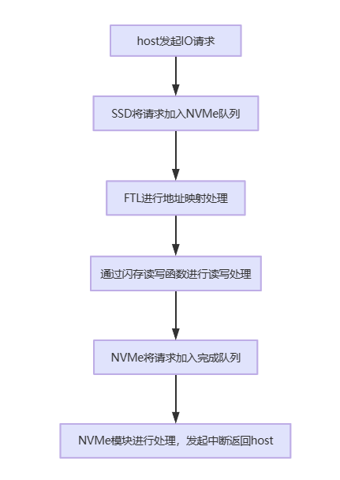
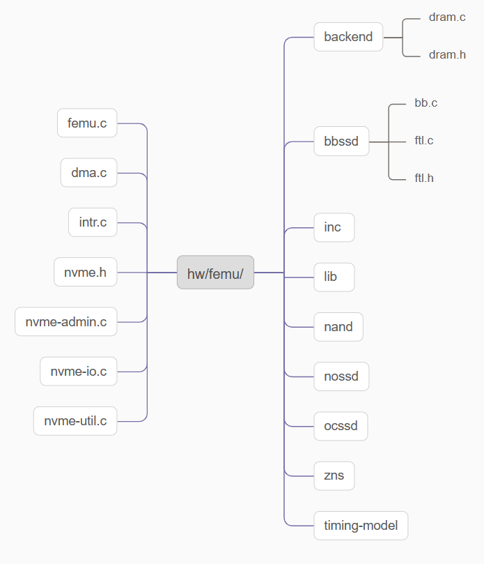
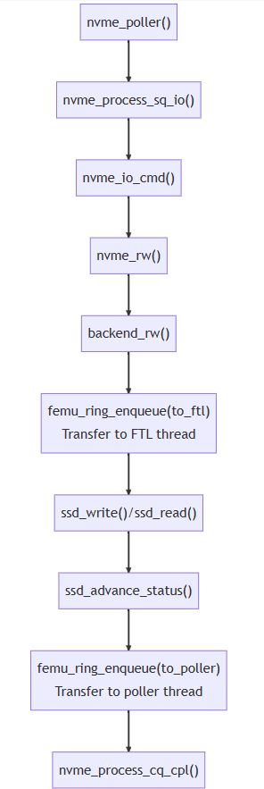
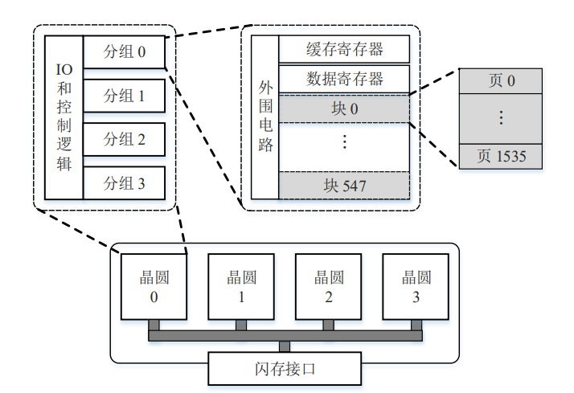
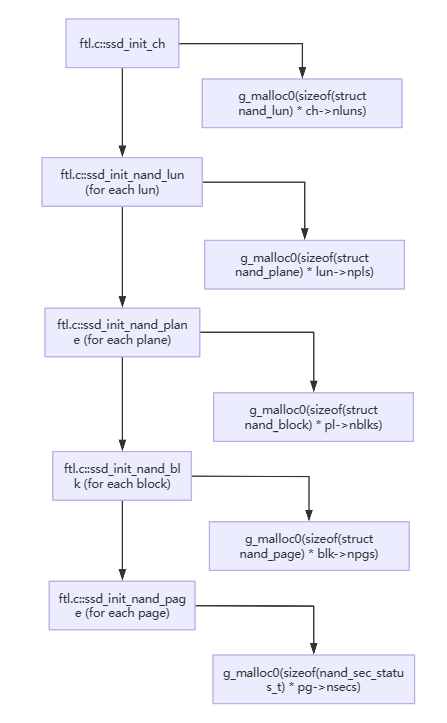
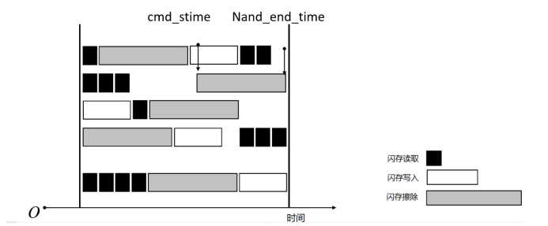
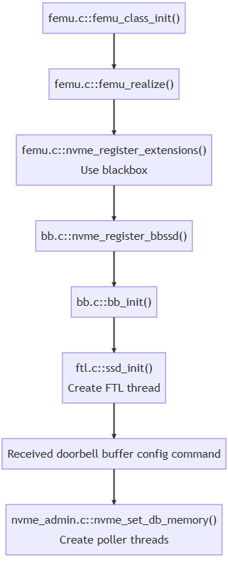

# 0 FEMU 简介

​	FEMU 是 FAST’18 上的一篇 SSD 模拟器论文（[The CASE of FEMU: Cheap, Accurate, Scalable and Extensible Flash Emulator](https://ucare.cs.uchicago.edu/pdf/fast18-femu.pdf)），在 QEMU 模拟器上实现。

​	QEMU作为广泛使用的虚拟机管理程序，本身集成了对支持nvme协议块设备的模拟，但其实现方式为内存盘RAM Disk，不支持对闪存延迟的仿真。FEMU则基于QEMU中原有的NVMe设备模拟模块，添加了对闪存内部结构、FTL、延迟仿真的支持，FEMU 使用内存模拟后端存储。时延的模拟是通过等待真实的时间流逝到期望的时延。在模拟过程中，QEMU 的主要作用是制作镜像，FEMU本身是自己编译了 QEMU，可理解为FEMU = QEMU + NVMe SSD 模拟。

​	FEMU源码仓库为：[GitHub - vtess/FEMU](https://github.com/vtess/FEMU)，位于 `hw/femu/` 目录下。

# 1 FEMU 总览

​	FEMU SSD是一个完整的系统，由NVMe（前端）、闪存（后端）和FTL三个主要模块组成，本文将在后续章节对于这三个模块进行详细讨论。

​	NVMe（前端）模块主要负责与主机进行通信，需要考虑与主机的接口方式与协议。

​	闪存（后端）模块主要与实际的存储介质（如NAND闪存）进行通信和管理。

​	FTL模块是SSD的核心部分，负责实现SSD的关键功能，包括地址映射、性能优化、中端的磨损均衡算法、垃圾回收等算法，这些算法对于SSD的性能和稳定性具有决定性作用。

​	NVMe 模块、FTL 线程通过队列进行交互，以一个 I/O 请求为例，NVMe（前端）、闪存（后端）和FTL模块协作流程如下：



​	基于这三个模块，FEMU代码总体目录构成如下：



- `backend/` 包含了用于保存模拟的 SSD 数据的内存后端代码，实现数据读写的功能模拟。
- `bbssd/` 包含了 blackbox SSD 对应的实现，blackbox 就是普通的黑盒 SSD，也就是 SSD 的管理是由内部的 FTL 进行的。该目录下主要包含的是 FTL 的实现。
- `nand/` 文件夹下包含了一些 NAND 时延相关的代码，但只有 OCSSD 模式使用。
- `ocssd/`和`zns/`文件夹下包括了对open-channel SSD 和 ZNS SSD的支持代码。
- `femu.c`用于 NVMe 协议仿真，包括 NVMe 队列对 （QP） 处理（基于轮询）和延迟仿真的功能。
- nvme为前缀的文件，同样用于NVMe协议仿真，包括结构体定义以及I/O模拟等功能的实现等内容。

# 2 FEMU NVMe 模块

​	FEMU 的 NVMe 模块负责处理主机端下发的 I/O 请求，解析 NVMe 命令并通过队列传递给 FTL Thread，同时接收 FTL Thread 处理好的 I/O 请求，并控制传递给 Host（主机端），完成 I/O 的处理。

## 2.1 NVMe 协议简介

​	NVMe协议为使用非易失性内存的固态硬盘通过PCIe总线与主机通信的标准。NVMe协议是一个上层协议，是主机和NVMe SSD之间的通信协议，需要主机和SSD共同实现。

​	NVMe协议本质上时一个生产者消费者模型，生产者（主机）将请求数据放入缓冲区，消费者（SSD）从缓冲区取出数据并进行处理。它们之间通过对缓冲区共享操作来协作。

​	NVMe核心实现模块有：

- SQ/CQ

​	提交队列SQ：提交队列是一个用于存储I/O命令的结构。主机按照一定的顺序将I/O命令填入提交队列，以便盘能够按序从中取出并执行这些命令。

​	完成队列CQ：完成队列是一个用于存储I/O完成消息的结构。盘在执行完I/O命令后，将I/O完成消息填入完成队列，供主机从中取出以确认I/O命令已经成功完成。

- DB寄存器

​	NVMe通过一种门铃机制(Doorbell)来告知控制器命令队列是否有新数请求/命令。也就是说每个队列都有一个门铃指针。对于发送队列来说，这个指针表示的是发送队列的尾指针。主机端将数据写入到发送队列后，更新映射到位于设备寄存器空间中的门铃的尾指针。此时，在控制器端就知道有新的请求/命令到来，接下来就可以进行对其进行处理。

- I/O and Admin cmd

​	命令是NVMe中的核心，主要有I/O命令和管理命令 (Admin Command)，I/O命令主要用于读写数据，管理命令用于管理和控制SSD设备，包括识别命令等。

- NVMe PRP、SGL

​	PRP和SGL是描述Host内存物理空间的两种方式，帮助SSD确定数据所在内存位置。PRP用于描述连续的物理内存页面，适用于较小或连续的数据传输；SGL用于描述非连续的内存块，适用于复杂的和分散的数据传输。

## 2.2 NVMe 功能实现

​	NVMe能够作为接口协议接收并处理主机命令，其命令处理功能包括主机提交命令、控制器处理命令并生成中断通知主机完成操作。


​	NVMe命令处理主要实现过程如上图所示，可分为以下三个部分：

* 命令提交

1. 主机将命令写入提交队列。
2. 主机将更新后的提交队列尾指针写入门铃寄存器。

* 命令处理

3. NVMe控制器获取命令。

4. NVMe控制器处理命令。

* 命令完成

5. 控制器将完成信息写入完成队列。
6. 控制器生成MSI-X中断。
7. 主机处理完成信息。
8. 主机将更新后的完成队列头指针写入门铃寄存器。

## 2.3 FEMU NVMe 模块基本功能

​	FEMU 的 NVMe 模块在处理请求时，主要解析其中的操作码 opcode、cdw等，来识别 I/O 请求或 Admin 请求。其中，Admin 请求便于我们在盘内添加一些自定义的特权命令，便于在主机端对盘内状态的统计。

​	下图是一个读写数据的I/O函数调用栈，具体函数分析见附录A。

​	其中nvme_io_cmd()到nvme_rw()的过程会经过一层与使用的SSD模式相关的中间函数，例如在bbssd模式下，通过n->ext_ops注册bb模式的函数后，完整路径为nvme_io_cmd->bb_io_cmd->bb_nvme_rw->nvme_rw。



​	由于FEMU是模拟器，当请求从主机传递到FEMU模拟的NVMe SSD时，实际的设备I/O（即数据存储）已经完成。主机想要保存的数据已经通过`backend_rw()`函数存储到DRAM后端中，之后的流程都是为了模拟I/O延迟。这一点使FEMU不仅可以真实地存储数据和重放追踪，还可以运行基准测试等负载生成器。

# 3 FEMU 闪存模拟

​	闪存（Flash Memory）是一种非易失性存储器，NAND闪存被广泛应用于各种存储设备中。它采用了页块等结构来组织数据，支持擦写和读取操作。FEMU通过结构组织和函数进行了NAND模拟，利用内存空间模拟存储功能，通过完成擦写等核心操作，并进行了闪存操作的时延模拟，维护了时间线，相关代码位于 hw/bbssd/ftl.h 和 hw/bbssd/ftl.c 文件中。 

## 3.1 基本结构

​	闪存是一种半导体存储器件，根据单元的阈值电压来确定所存储的比特信息， 而电压的大小取决于单元内存储的电子数量。根据每个单元存储的比特数量，闪存可以分为 SLC（single-level cell）、MLC（multi-level cell）、TLC（triple-level cell）和 QLC（quadruple-level cell）。它们将单元的阈值电压状态分别划分为 2、4、8 和 16 个层级，实现了每个单元分别存储 1、2、3 和 4 个比特的信息。以 SLC 为例，当闪 存单元没有存储电子时，表示比特信息 1；当利用编程操作向闪存单元注入一定数量 的电子后，表示比特信息 0。因此，闪存的写操作，也称为编程操作，是将存储状态由 1 变成 0。存储状态由 0 变为 1 只能通过擦除操作，即将闪存单元内的电子全部抽 出。 

​	大量的闪存单元按照一定的结构组织成闪存芯片，如下图。一般而言， 一个芯片（chip）包含一个或者多个（2 个到 16 个）晶圆（die），晶圆具备独立的 I/O 和控制逻辑电路，是独立执行命令和报告操作状态的最小单位；每个晶圆包含多个 （2 个或者 4 个）分组（plane），分组设置有两个页大小的寄存器，数据通过 I/O 信 号线经由寄存器从闪存读出或者向闪存写入；每个分组包含成百上千个块（block）； 每个块包含成百上千个页（page），每个页包含一个数据区和一个额外存储区，通常 所说的页大小是指数据区的大小。数据区用于存储数据，大小一般是 8KB 或者 16KB， 额外存储区对用户是不可用的，用于存储数据的纠错码冗余和逻辑页号等元数据， 大小一般是数据区大小的 1/8 左右。



## 3.2 FEMU backend支持

​	FEMU 完全按照闪存基本结构来实现，但并不把数据写到真实盘中，它把数据保存在主机内存中，SSD暴露给用户的空间实际上决定的是FEMU向主机申请的内存大小。初始化函数中调用了`dram.c::init_dram_backend`向主机申请了模拟的SSD的内存空间，代码如下：

```C
int init_dram_backend(SsdDramBackend **mbe, int64_t nbytes)
{
    SsdDramBackend *b = *mbe = g_malloc0(sizeof(SsdDramBackend));

    b->size = nbytes;
    b->logical_space = g_malloc0(nbytes);

    if (mlock(b->logical_space, nbytes) == -1) {
        femu_err("Failed to pin the memory backend to the host DRAM\n");
        g_free(b->logical_space);
        abort();
    }

    return 0;
}
```

​	此外，初始化函数还调用SSD中ssd_init_nand_page等一系列初始化函数，通过嵌套调用以及调用g_malloc0函数对于内存进行分配，最终达到backend支持。初始化函数形成调用关系如下图所示。



# 4 FEMU FTL

​	FTL 算法的作用是向主机屏蔽闪存的操作特性，实现对闪存的基本管理。

​	由于闪存以页为基本的读写单位，FTL 需要将主机下发的读写请求转化为对闪存页的访问；由于闪存具有先擦后写的特性，为了避免每次数据更新都进行块擦除操作，FTL 采取异地更新的机制。当发生数据更新时，FTL 将新数据写到一个新的空闲页，然后将原始数据页置为无效。所以，在固态盘的运行过程中，逻辑地址对应的物理页地址会不断发生变化，而且不断会有无效闪存页产生，即产生了“垃圾”。这使得 FTL 需要实现地址映射算法、垃圾回收算法和损耗均衡算法。

​	地址映射算法负责将 I/O 请求的逻辑地址转化为闪存上的物理地址，即动态维护一张逻辑页地址到闪存物理页地址的映射表，实现数据在闪存上的基本管理；垃圾回收算法负责回收无效数据占据的存储空间，以保证固态盘能够供应足够的空闲页，在回收过程中，需要对包含 无效数据的闪存块进行擦除；擦写操作会永久性损耗闪存块，损耗均衡算法需要尽可能地保证所有的闪存块处于相近的损耗状态，避免部分闪存块过早地坏掉，从而延长固态盘的寿命。其中，地址映射算法是 FTL 的核心，垃圾回收算法和损耗均衡 算法需要依赖于它的实现。

​	FTL中以superblock的方式组织块增加读写并行度，而FEMU用line_mgmt 作为管理结构实现superblock的功能，维护多种line队列，对line进行管理和调度。

​	FEMU 的 FTL 只实现了闪存块组织、读写请求处理、地址映射和垃圾回收功能，同时进行延迟仿真，没有考虑磨损均衡、缓存管理、坏块管理、ECC 等等。

​	FTL的代码在`hw/bbssd/ftl.h`和`hw/bbssd/ftl.c`中。

## 4.1 闪存块组织

​	FTL中以superblock的方式组织块增加读写并行度，superblock闪存的基本思想是映射N个逻辑块到N+M个物理块，通过合并若干相邻逻辑块构建一个超级块以利用块级别的空间局部性。空间上的局部性是指相邻逻辑Block里面的Page更加可能在一个更新之后另外的也被更新。

- 优势
  - 是SSD擦除的基本粒度，便于管理。
  - 充分利用闪存的并行性（Channel、Die、Plane），提供较高的读写性能。
  
- FEMU 中如何设置 OP 空间
  
  OP (Over-Provisioning) ，即预留空间。一般占总硬盘容量的7%左右，用于垃圾回收GC、存储SSD主控固件和备用数据块等，在实际硬盘使用中能够提高硬盘的耐用性，一定程度上保证硬盘的运转性能。
  
  - 启动脚本中通过 SSD 结构信息确定整个 SSD 的总体容量。
  
  ```c
  ssd_size=12288 /*in MB, 12GB*/
  ...
  FEMU_OPTIONS=${FEMU_OPTIONS}",devsz_mb=${ssd_size}"
  ...
  ```
  
  - 通过 QEMU 挂在设备指定暴露给主机端的可用容量计算得出差值，该差值即为 OP 空间。

## 4.2 地址映射

​	为了加快地址转换的速度，固态盘使用一部分 RAM 缓存地址映射表，称之为映射缓存。根据映射粒度的不同，地址映射算法分为四类：页映射，块映射，混合映射和变长映射。

​	FEMU 使用 4 KB 页映射，维护映射表和反向映射表，保证地址映射的高效实现。页映射以闪存页为基本映射单元，一个逻辑页地址（logical page number,  LPN）可以映射到任何物理页地址（physical page number, PPN）。页映射的地址映射 表（LPN-PPN）非常大，一个页大小为 4KB 或者 8KB 的 1TB 的固态盘，表大小分别为 1GB 或者 512MB（只存储 4B 大小的 PPN）。页映射的优点在于灵活性高和写性能好，缺点在于页映射表大，导致地址转换开销大。

​	FEMU本身的数据存取不依赖地址映射，但是需要地址映射来保证延迟仿真的正确性，例如写入的闪存页映射到了哪个 Die/LUN。

​	GC时，涉及有效数据的迁移，包含数据读取和数据合并写入、SuperBlock擦除这三个过程，地址映射可以准确的实现对这三个步骤的延迟仿真（对相应的Die/LUN施加闪存读、写、擦延迟，推进时间线）。

## 4.3 垃圾回收

​	垃圾回收操作的基本过程是：选择一个包含无效页的闪存块作为回收块；将回收块中的有效页迁移到新的空闲页中，同时，修改相应的地址映射表；待回收块中所有的有效页都已完成迁移后，擦除回收块，将其加入到空闲块池，以备使用。

​	垃圾回收操作属于固态盘的后台操作，虽然能够回收无效的存储空间，但是会阻塞用 户的 I/O 请求，降低固态盘的性能（这是为什么固态盘在使用一段时间后可能出现性能急剧下降的主要原因），并增加固态盘的写放大和闪存块的损耗。对垃圾回收算法的研究主要集中在以下几个方面。

​	第一，触发垃圾回收操作的时机。触发时机一般分为两种：一种是主动触发， 即在固态盘 I/O 空闲时触发垃圾回收操作；另一种是被动触发，当空闲块的数量低于某个阈值时触发垃圾回收操作，这是固态盘正常运行的必要保证，但是可能会严重阻塞用户的 I/O 请求。 FEMU采用在读写操作中进行被动触发 GC 的机制，每次写操作都判断是空闲line的数目是否小于阈值，若小于阙值则进行强制 GC 。

​	第二，如何选择回收块。回收块的选择应该考虑块内的无效页比例、块内数据的冷热程度（经常被更新的数据被称为热数据，相对较少更新的数据被称为冷数据）、 块的已擦除次数等多个因素，它们决定了垃圾回收操作的效率。FEMU通过从优先队列中出队为 GC 选择一个victim line，优先队列的实现基于二叉堆，选择时，如果强制回收参数为false，则必须保证当前选中的 superblock/line 中 ipc 无效页的比例大于 1/8， 这是为了保证一次 GC 尽可能的回收更多空间，降低 GC 开销，以提高性能。

​	第三，分多阶段执行垃圾回收操作。一次垃圾回收操作包括多个有效页的读、 写操作和一个块的擦除操作，分多阶段执行这些原子操作能够有效减少对用户 I/O 请求的阻塞，加强对空闲空间的利用，使得固态盘能够为应用提供更好的服务质量保证。FEMU中，使用`gc_read_page`, `gc_write_page`等函数进行 GC 操作的阶段执行，具体函数分析见附录C。

## 4.4 延迟仿真

​	FEMU 只能模拟到 Die/LUN 级别并行，模拟的方法是为每个 Die/LUN 维护一个时间线，在进行闪存读写擦时推进相应Die的时间线。

​	对于一个FEMU中的 I/O 而言，I/O 的延迟由这几个部分组成：

- SSD 获取 I/O 并解析，提交给 FTL，在队列中等待。

- FTL 处理，并计算请求的闪存延迟，提交给poller线程。

  请求的闪存延迟由 `ssd_advance_status `函数实现模拟，在读写擦相关操作时调用该函数即可。

- 请求在 poller 线程中等待，根据expire time返回给主机端。

  通过真实时间消耗，模拟系统的时延推进。主要通过真实系统时间 QEMU_CLOCK_REALTIME ，数据结构中的 expire_time 变量成员辅助完成， expire_time 变量表示io应该结束的时间（到期时间），用于控制何时向主机返回请求，如果当前时间小于请求的 expire_time，则不进行中断返回操作。

​	根据以上分析，有时延模拟的命令时间图如下所示，时间轴上空闲部分则为命令在lun空闲时间或命令的时间戳限制下的等待时间。



## 4.5 读写请求处理

​	固态盘处理 I/O 请求的整个过程需要维护三种队列：主机下发的 I/O 请求的队列， 由 I/O 请求和后台操作（比如垃圾回收操作）转化而来的基于闪存页的子请求队列， 以及根据子请求生成的闪存命令队列。FTL中处理读写请求的逻辑主要步骤如下：

- 从线程中取出并解析请求，获得 lba并进行地址转换获得 I/O 逻辑地址。
- 查映射表，如果 `ppa` 已经映射，则将对应的物理页标记为无效，并在逆向映射表中进行对应设置，获取一个新的物理页地址 `ppa`。更新映射表、逆向映射表，标记新的物理页为有效。
- 按照`ppa`及请求类型进行延迟仿真，并计算请求的最终延迟。

# 5 FEMU 环境配置和初始化

## 5.1 FEMU 环境配置

### 5.1.1 在 ubuntu 中安装使用 QEMU

​	如FEMU简介所述，FEMU是基于 QEMU虚拟机实现的，因此需要首先在安装好的ubutu系统中进行QEMU安装。

​	QEMU是一个开源的C语言编写的虚拟化软件，全称为"Quick Emulator"。QEMU提供了几种虚拟化模式。首先它可以利用基于内核的虚拟机（KVM）来实现x86处理器的硬件虚拟化，以接近本机硬件的速度执行计算任务。其次它可以通过实时转换机器代码的方式来模拟其他处理器，从而在虚拟机中运行不同平台的操作系统。最后，它还可以使用实时转换技术来在其他架构上运行简单的程序。由于QEMU本身没有图形用户界面（GUI），但它提供了核心功能，因此通常作为更复杂虚拟化管理器的一部分被使用。

​	在ubuntu中安装QEMU，直接打开ubuntu终端界面，运行指令：

```c
sudo apt-get install qemu
```

​	若ubuntu系统版本为20.04，可能会出现使用此指令安装的软件十分有限的现象，可随后运行以下指令：

```c
sudo apt-get install qemu-system
```

​	安装后重启ubuntu系统，在终端界面输入：

```c
qemu-
```

​	输入后按下tab键（注意不是enter键）即可查看当前可模拟的环境，若成功查看，则安装成功。

### 5.1.2 FEMU安装准备

1. 内存要求

​	需要确保ubuntu至少有 8GB 或更多的内存可用。

​	阅读启动FEMU并创建SSD模拟的.sh文件可知，该虚拟机配置了 4 个 CPU 核心 (`-smp 4`) 和 4GB 的内存 (`-m 4G`)。因此，至少需要 4GB 的可用内存才能满足虚拟机的内存需求。考虑ubuntu本身以及其他正在运行的应用程序对内存的需求，建议在启动FEMU前，确保主机系统至少有 8GB 或更多的内存可用。若更改了.sh文件中对于内存的配置，对应的内存需求也会相应更改。

2. 存储空间要求

​	需要确保ubuntu中有20G左右的存储空间，否则可能在解压官方文档时出现内存耗尽的问题。

​	由官方虚拟机镜像参数分析可知，磁盘虚拟大小为80G，实际为13G，即该镜像文件在物理磁盘上占用了 13GB 的存储空间，考虑到除镜像文件外的资源使用和下载，建议在ubuntu中预留20G以上的存储空间。若不使用官方虚拟机镜像，而采用自行创建的虚拟机镜像进行模拟，对应的存储空间需求也会相应更改。

3. 其他注意事项

​	为避免嘈杂导致资源争用，请尽量避免 FEMU 与ubuntu上的其他应用程序共同运行（或者确保有丰富的资源可以在 FEMU 和其他应用程序之间进行分区）。

### 5.1.3 安装虚拟机镜像

​	官方镜像和自定义镜像二选一完成即可。

1. 使用官方镜像

​	本步骤之后能够得到文件"u20s.qcow2" 以及 "u20s.md5sum"。

```c
cd //一定要回到home路径，否则需要在后续运行中更改运行路径
mkdir -p ~/images/
cd ~/images
wget http://people.cs.uchicago.edu/~huaicheng/femu/femu-vm.tar.xz
tar xJvf femu-vm.tar.xz
```

2. 自定义镜像

​	首先按如下步骤制作镜像。

```c
//创建路径，若路径不一致，则需要在后续运行中更改运行路径
cd 
mkdir -p ~/images/
cd ~/images
    
// 下载 Ubuntu 镜像
wget https://releases.ubuntu.com/22.04.1/ubuntu-22.04.1-live-server-amd64.iso

// 制作磁盘镜像
qemu-img create -f qcow2 u20s.qcow2 80G

// ubuntu 镜像挂在 cdrom 上启动
// 安装过程需要通过 vnc 连接操作，端口号 5901
qemu-system-x86_64 -m 2G -cdrom ubuntu-22.04.1-live-server-amd64.iso -hda u20s.qcow2 -boot d -vnc :1

// 安装完成后重启，再 vnc 连接一次，修改内核启动参数
qemu-system-x86_64 -m 2G -hda u20s.qcow2 -vnc :1
```

​	随后修改虚拟机输出配置。

```c
// 在虚拟机内
sudo vim /etc/default/grub
// 用于保证 grub 界面能输出到屏幕
GRUB_TIMEOUT=3
GRUB_TERMINAL=serial

// 用于保证内核启动时能输出到屏幕
GRUB_CMDLINE_LINUX="ip=dhcp console=ttyS0,115200"

// (可选)屏蔽子菜单和 recovery 内核，方便快速切换内核
GRUB_DISABLE_SUBMENU=y
GRUB_DISABLE_RECOVERY="true"
// 更新 grub
sudo update-grub
sudo poweroff
```

### 5.1.4 FEMU环境安装

​	根据官方文档，在ubuntu终端中进行以下安装步骤。

1. 下载FEMU

​	从官方github下载FEMU，如果下载失败，可将https改为http。

```c
git clone https://github.com/ucare-uchicago/femu.git
```

2. 编译并安装FEMU

​	进入刚刚下载的femu文件，创建文件夹，编译并安装FEMU。

```c
cd femu
mkdir build-femu
cd build-femu
cp ../femu-scripts/femu-copy-scripts.sh .
./femu-copy-scripts.sh .
sudo ./pkgdep.sh
./femu-compile.sh
```

### 5.1.3 FEMU 使用

​	按如下步骤启动FEMU，若使用官方镜像，需要使用官方默认的用户名和密码，username: femu ，passwd : femu。run-blackbox.sh 启动后，进入系统可以看到nvme0n1设备，可以直接对块设备进行测试或者制作文件系统并挂载后测试。

```c
cd /path/to/femu //注：进入自己ubuntu中第一步安装FEMU的文件夹
cd build-femu
./run-blackbox.sh
```

## 5.2 FEMU 初始化

​	5.1启动run-blackbox.sh 后，实际上进行了FEMU的一系列初始化操作。FEMU初始化由QEMU触发，由一系列初始化函数的调用进行函数注册、参数赋值、内存分配提供backend支持等操作。本节对FEMU初始化以 blackbox 模式为例进行分析。

### 5.2.1 初始化流程

​	初始化开始的入口在`hw/femu/femu.c`文件中，具体流程如下：



​	首先是由 QEMU 触发的初始化，`femu_class_init()` 为入口，在该过程中会设置 PCIe 配置空间中的固定信息，注册对应的函数；部分代码如下：

```C
static void femu_class_init(ObjectClass *oc, void *data)
{
    ...
    // 注册函数
    pc->realize = femu_realize;
    pc->exit = femu_exit;
    pc->class_id = PCI_CLASS_STORAGE_EXPRESS;
    pc->vendor_id = PCI_VENDOR_ID_INTEL;
    pc->device_id = 0x5845;
    pc->revision = 2;
    ...
    // 设置设备属性
    device_class_set_props(dc, femu_props);
    ...
}
```

​	然后，`femu_realize()`会在qemu初始化PCI总线（函数为`pci.c::pci_qdev_realize`）时被调用，在该过程中会分配内存空间，并调用`nvme_register_extensions()`，`nvme_register_extensions()`根据模式调用`bb.c::nvme_register_bbssd()`，最后调用注册的init成员函数（blackbox模式下是`bb_init()`），初始化相应模式ssd；部分代码如下：

```C
// 注册成员函数
int nvme_register_bbssd(FemuCtrl *n)
{
    n->ext_ops = (FemuExtCtrlOps) {
        .state            = NULL,
        .init             = bb_init,
        .exit             = NULL,
        .rw_check_req     = NULL,
        .admin_cmd        = bb_admin_cmd,
        .io_cmd           = bb_io_cmd,
        .get_log          = NULL,
    };

    return 0;
}

// 根据模式注册NOSSD/BBSSD/ZNSSD/OCSSD
static int nvme_register_extensions(FemuCtrl *n)
{
    if (OCSSD(n)) {
        ...
    } else if (BBSSD(n)) {
        nvme_register_bbssd(n);
    } 
    ...
    return 0;
}

static void femu_realize(PCIDevice *pci_dev, Error **errp)
{
    FemuCtrl *n = FEMU(pci_dev);
    int64_t bs_size;
    ...
    //向主机申请内存空间
    bs_size = ((int64_t)n->memsz) * 1024 * 1024;
    init_dram_backend(&n->mbe, bs_size);
    ...
    //分配内存空间
    /* Coperd: [1..nr_io_queues] are used as IO queues */
    n->sq = g_malloc0(sizeof(*n->sq) * (n->nr_io_queues + 1));
    n->cq = g_malloc0(sizeof(*n->cq) * (n->nr_io_queues + 1));
    n->namespaces = g_malloc0(sizeof(*n->namespaces) * n->num_namespaces);
    ...
    //初始化相应模式ssd
    nvme_register_extensions(n);
    // 调用注册的init成员函数，初始化相应模式ssd
    if (n->ext_ops.init) {
        n->ext_ops.init(n, errp);
    }
}
```

​	`bb_init()`再初始化bbssd的有关结构，最终执行`ssd_init()`来初始化ssd。

### 5.2.2 SSD参数初始化

​	在3.1的内容中提到`struct FemuCtrl` 代表了 FEMU 的 NVMe 类型，是顶层的数据结构，用于控制平面，并且包含了SSD的一些时延和容量参数等，这些参数也在`femu_class_init()` 执行中调用`device_class_set_props()`进行了初始化。

​	根据qemu提供的文档，与设备关联的属性只能使用`device_class_set_props()`进行分配，可确保在有人尝试直接分配 dc->props 时出现编译错误，qemu文档对该函数解释如下：

> **void device_class_set_props(****[DeviceClass](https://www.qemu.org/docs/master/devel/qdev-api.html#c.DeviceClass)** ***dc, Property \*props)**
>
> add a set of properties to a device
>
> **Parameters**
>
> **`DeviceClass \*dc`**
>
> the parent DeviceClass all devices inherit
>
> **`Property \*props`**
>
> an array of properties, terminate by DEFINE_PROP_END_OF_LIST()

​	femu遵循qemu提供的API，定义了`femu_props`，并在调用`device_class_set_props()`时将其作为参数。

```C
static Property femu_props[] = {
    DEFINE_PROP_STRING("serial", FemuCtrl, serial),
    DEFINE_PROP_UINT32("devsz_mb", FemuCtrl, memsz, 1024), /* in MB */
    DEFINE_PROP_UINT32("namespaces", FemuCtrl, num_namespaces, 1),
    DEFINE_PROP_UINT32("queues", FemuCtrl, nr_io_queues, 8),
    DEFINE_PROP_UINT32("entries", FemuCtrl, max_q_ents, 0x7ff),
    DEFINE_PROP_UINT8("multipoller_enabled", FemuCtrl, multipoller_enabled, 1),
    ...
    DEFINE_PROP_UINT8("flash_type", FemuCtrl, flash_type, MLC),
    ...
    DEFINE_PROP_INT32("secsz", FemuCtrl, bb_params.secsz, 512),
    DEFINE_PROP_INT32("secs_per_pg", FemuCtrl, bb_params.secs_per_pg, 8),
    DEFINE_PROP_INT32("pgs_per_blk", FemuCtrl, bb_params.pgs_per_blk, 256),
    DEFINE_PROP_INT32("blks_per_pl", FemuCtrl, bb_params.blks_per_pl, 256),
    DEFINE_PROP_INT32("pls_per_lun", FemuCtrl, bb_params.pls_per_lun, 1),
    DEFINE_PROP_INT32("luns_per_ch", FemuCtrl, bb_params.luns_per_ch, 8),
    DEFINE_PROP_INT32("nchs", FemuCtrl, bb_params.nchs, 8),
    DEFINE_PROP_INT32("pg_rd_lat", FemuCtrl, bb_params.pg_rd_lat, 40000),
    DEFINE_PROP_INT32("pg_wr_lat", FemuCtrl, bb_params.pg_wr_lat, 200000),
    DEFINE_PROP_INT32("blk_er_lat", FemuCtrl, bb_params.blk_er_lat, 2000000),
    DEFINE_PROP_INT32("ch_xfer_lat", FemuCtrl, bb_params.ch_xfer_lat, 0),
    DEFINE_PROP_INT32("gc_thres_pcent", FemuCtrl, bb_params.gc_thres_pcent, 75),
    DEFINE_PROP_INT32("gc_thres_pcent_high", FemuCtrl, bb_params.gc_thres_pcent_high, 95),
    DEFINE_PROP_END_OF_LIST(),
};
```

​	其中DEFINE_PROP_XXX的宏定义在hw/qdev-properties.h中，它是给Property类型的数组增加对应类型元素的一系列宏，例如DEFINE_PROP_STRING的宏及其调用的宏定义如下：

```C
#define DEFINE_PROP_STRING(_n, _s, _f)             \
    DEFINE_PROP(_n, _s, _f, qdev_prop_string, char*)

#define DEFINE_PROP(_name, _state, _field, _prop, _type, ...) {  \
        .name      = (_name),                                    \
        .info      = &(_prop),                                   \
        .offset    = offsetof(_state, _field)                    \
            + type_check(_type, typeof_field(_state, _field)),   \
        __VA_ARGS__                                              \
        }
```

​	`	femu_props`的成员参数可以通过脚本在运行指定，在run_blackbox.sh中如下指定的是模拟的SSD暴露给用户的空间大小，需要注意的是指定参数用的不是FemuCtrl结构体成员的变量名，而是在`femu_props`中注册的_name（宏定义调用的第一个字符串参数）。

# 6 Reference && 附录

## 附录A NVMe 相关函数及数据结构

### 1 数据结构

​	NVMe数据结构的定义主要位于hw/femu/nvme.h，其中主要数据结构有：

```c
typedef struct FemuCtrl {
    //Nvme参数等结构
    NvmeErrorLog    *elpes;		//错误日志结构
    NvmeIdCtrl      id_ctrl;
    NvmeBar         bar;
    //Nvme命令结构
    NvmeRequest     **aer_reqs;
    NvmeSQueue      **sq;		// IO发送命令队列
    NvmeCQueue      **cq; 		// IO完成命令队列
    
    //ocssd相关结构
    OcCtrlParams    oc_params;
    Oc12Ctrl  *oc12_ctrl;
    
    //zns ssd相关结构
    struct zns_ssd *zns;
    ZNSCtrlParams zns_params;
    
    //FTL相关结构
    struct ssd      *ssd;
    struct rte_ring **to_ftl;    // poller到FTL的队列
struct rte_ring **to_poller; 	 // FTL到poller的队列
    
    //……
    //其他数据及参数结构
} FemuCtrl;
```

​	由图，`struct FemuCtrl`是顶层的数据结构，用于控制平面，与FTL、NVMe等核心模块均有协作关联，接下来对NVMe相关部分进行具体分析。

#### 1.1 命令相关结构体

1. **`struct NvmeRequest`**

​		用于表示 NVMe命令的相关信息，包括指向请求提交队列和完成队列的指针，队列信息、命名空间、操作类型、元数据、命令、完成队列条目等成员变量，是NVMe的主要命令结构。

​		`NvmeRequest `主要数据成员如下：

```c
struct NvmeRequest {
    struct NvmeSQueue *sq;        // 指向 NVMe 存储队列的指针
    struct NvmeCQueue *cq;        // 指向 NVMe 完成队列的指针
    NvmeCmd cmd;                  // NVMe 命令结构体
    NvmeCqe cqe;                  // NVMe 完成队列元素结构体
    
    uint16_t status;              // 请求的状态
    int64_t stime;                // 请求开始时间
    int64_t reqlat;               // 请求延迟时间
    int64_t gcrt;                 // 请求完成时间
    int64_t expire_time;          // io应该结束的时间
    
    //······
    //其他结构省略
};
```

2. **`struct NvmeCmd`**

​		用于表示 NVMe 命令的格式和参数，包括命令的类型、操作码、数据传输方式以及命令特定的参数等信息。

3. **`struct NvmeCQueue`**

​		用于描述 NVMe完成命令队列的控制信息，包括头指针、尾指针、中断管理成员以及各种属性参数。

```c
struct NvmeCQueue {
    //NVMe 设备在完成队列有新的完成项时可能会触发中断，故需要相关控制成员
    uint16_t irq_enabled;          // 中断是否已启用
    int32_t virq;                  // 虚拟中断号
    uint32_t vector;               // 中断向量
    
    uint32_t head;                 // 队列头部索引
    uint32_t tail;                 // 队列尾部索引
    //······
    //其他结构省略
};
```

4. **`struct NvmeSqueue`**

​		用于描述 NVMe发送命令队列的控制信息，包括头指针、尾指针以及各种属性参数，该数据结构无中断管理成员，其他成员与 `NvmeCQueue`类似。

5. **`struct NvmeCqe`**

​		用于表示 NVMe完成队列条目，即 NVMe 完成队列中的一个完成项，能够存储 NVMe 命令的执行结果、完成项对应的请求在提交队列中的位置、命令的执行状态或结果等属性信息。

#### 1.2 **其他功能**结构体

1. **`struct NvmeBar`**

​		用于描述NVMe控制器的寄存器映射寄存器区域的参数和状态信息。

2. **`struct NvmeldCtr`**

​		存储有多个NVMe属性变量，能够用于描述 NVMe设备的命令集属性、提供延迟带宽等性能相关参数。

3. **`struct NvmeErrorLog`**

​		用于记录和描述NVMe设备中发生的错误情况。它能够提供错误计数、与错误相关的提交队列相关信息、错误参数位置等数据，可用于故障排除、错误诊断和设备性能分析。在初始化时，动态为该成员分配足够的内存空间用于存放错误情况。

4. **`struct NvmeNamespace`**

​		用于存储NVMe命名空间的综合信息，有指向命名空间相关的 NVMe 控制器 （`FemuCtrl` 结构体）的指针以及命名空间的标识符、大小等属性信息。`NvmeNamespace`结构体与`FemuCtrl` 结构体互相调用协作。FEMU目前仅支持一个命名空间。

### 2 函数

#### 2.1 时延模拟相关函数

​	FEMU通过真实时间消耗，模拟系统的时延推进。主要通过真实系统时间`QEMU_CLOCK_REALTIME`，`NvmeRequest`数据结构中的`expire_time`变量成员辅助完成，`expire_time`变量表示io应该结束的时间（到期时间），用于控制何时向主机返回请求。

​	相关函数分析如下：

**nvme_process_sq_io**

​	整体功能：从sq中取出req，放入to_ftl队列中，交由ftl处理。具体分析如下：

1. 更新尾指针位置，随后判断是否有新请求。

2. 设置req->expire_time为当前时间，用于后续判断是否到达请求的完成时间，便于进行时延模拟。

3. 调用nvme_io_cmd进行在实际在内存上的操作并返回状态，若状态不对则操作失败。

4. 交给FTL线程进行时延模拟。

5. 重复2-4直到sq队列为空（队列头指针==尾指针）。

**nvme_process_cq_cpl**

​	整体功能：从to_poller队列中取req，放入cq中，然后通过中断通知上层操作已完成。具体分析如下：

1. 循环从to_poller队列中取出req，将请求按照预计完成时间 expire_time 的优先级插入队列。

2. 处理已到期的请求，实现请求的时延模拟。函数通过循环从优先级队列中取出请求，如果当前时间小于请求的 expire_time，表示请求尚未到期，则退出循环。一旦请求到期，函数会执行以下操作：
   * 若请求完成队列活跃，调用 nvme_post_cqe函数 处理请求，并将请求插入到完成队列的请求列表的尾部，并从优先级队列 中移除已处理的请求。
   * 更新统计信息，包括总的 I/O 数量和延迟 I/O 数量，设置中断位为true，表示请求所属队列需要触发中断。

3. 中断通知上层取cq。

**nvme_post_cqes_io**

​	整体功能：检查完成队列是否已满，如果未满且请求的过期时间已经到达，则将请求发送给主机。主要在删除 NVMe 的提交队列时调用，非主要IO功能函数。具体分析如下：

1. 遍历完成队列请求。
2. 判断完成队列是否已满，队列已满则停止处理更多请求，退出循环。
3. 获取当前时间，通过expire_time检查请求是否已到期。如果完成队列有效且当前时间小于请求的 expire_time，则将下一个触发时间设置为该请求的 expire_time，并且跳出循环，模拟等待请求完成的时延。
4. 处理请求，计算下一个触发时间，触发中断通知。

#### 2.2 其他IO功能函数

**nvme_poller**

​	nvme poller线程函数，不断处理sq和生成cq。

**nvme_rw**

​	读写函数，通过n->ext_ops注册bb模式的函数后，bb_io_cmd->bb_nvme_rw->nvme_rw到达，写入到内存。

**nvme_io_cmd**

​	处理io类型的commad，识别cmd类型并调用相关函数。

**nvme_post_cqe**

​	将cqe根据req获取一些信息后插入到cq队列。

**nvme_copy_cmd**

​	从DRAM(内存)中读取指令。

## 附录B 闪存相关函数及数据结构

相关代码位于`hw/bbssd/ftl.h`和`hw/bbssd/ftl.c`文件中。

### 1 数据结构

​	FEMU 将 NAND 按照page、blk、LUN、channel由小到大进行划分，以下为表示各层级单位的数据结构：

1. **`struct nand_page`**

​		包含一个指向 `nand_sec_status_t`（即`int`） 类型的指针以及多项属性变量，用于表示NAND页，包含了扇区数据、扇区数量等状态信息。

2. **`struct nand_block`**

​		包含一个指向 `struct nand_page` 类型的指针以及多项属性变量，用于表示 NAND 块，包含了页数据、页数量以及一些与块相关的统计信息。

3. **`struct nand_plane`**

​		包含一个指向 `struct nand_block`类型的指针以及属性变量，用于表示NAND 平面，包含了块数据和块数量。

4. **`struct nand_lun`**

​		包含一个指向 `struct nand_plane` 类型的指针以及多项属性变量，用于表示NAND LUN（逻辑单元），包含了平面数据、平面数量以及一些与 LUN 相关的状态信息。

5. **`struct ssd_channel`**

​		包含一个指向 `struct nand_lun` 类型的指针以及多项属性变量，用于表示 SSD 通道，包含了 LUN 数据、LUN 数量以及一些与通道相关的状态信息。

​	其他管理数据结构：

1. **`struct ssd`**

   用于定义SSD 的属性和组件，包括名称、参数等属性，同时包含了与 NVMe IO 线程通信的环形队列、数据平面状态和线程信息。

   ssd结构关键数据成员：

   * Page 粒度映射表 `struct ssd.maptbl`。直接使用数组保存 LPN->PPN 的映射。
   * 反向映射表 `struct ssd.rmap`。使用数组保存 PPN->LPN 的映射。

2. **`struct ssdparams`**

   包含多项参数和计算值，以及垃圾回收阙值，用于描述 SSD 的特性和配置。

3. **`struct ppa`**

​		包含一个联合体以及多项属性变量，用于表示物理地址，管理逻辑地址到物理地址的映射。

### 2 函数

#### 2.1 初始化函数

**ssd_init**

​	初始化SSD。包括设置参数/初始化映射表/初始化空间/初始化写指针/创建ftl_thread。

**ssd_init_nand_page/ssd_init_nand_blk/ssd_init_nand_plane**

​	初始化page/block/plane，分配内存和初始化其他结构体成员。

**ssd_init_nand_lun/ssd_init_ch**

​	初始化lun/channel，除了分配内存外还要设置下一空闲时间和置忙位为0。

**ssd_init_params**

​	根据FemuCtrl结构体计算并设置ssd的相关参数。

#### 2.2 辅助函数

**check_addr**

​	用于判断地址是否合法。

**get_new_page**

​	用于获取一个新页。实际上是创建一个ppa结构体变量，并将其的channel/lun/page/block/plane设置成写指针指向的位置。

**ssd_advance_status**

​	作为基础辅助函数，根据操作命令类型得到对应基础模拟时延。详细模拟过程如下：

1. 提取出当前要执行的 NAND 命令，提取命令的时间戳赋值给`cmd_stime`，如果命令没有指定时间戳，则使用当前实时时间戳 (`qemu_clock_get_ns(QEMU_CLOCK_REALTIME)`)。

2. 根据命令类型计算延迟：

   操作类型被分为读取 (`NAND_READ`)、写入 (`NAND_WRITE`) 和擦除 (`NAND_ERASE`) 三类，实际计算代码如下：

```c
//nand_stime表示NAND设备执行命令的时间，cmd_stime见步骤1
//若指令到达时间时lun在忙需要改变nand_stime
nand_stime = (lun->next_lun_avail_time < cmd_stime) ? cmd_stime : 
                     lun->next_lun_avail_time;
//nand_stime加上具体操作时间是lun下次空闲的时间
lun->next_lun_avail_time = nand_stime + spp->具体操作时间成员;
//做差得到时延
lat = lun->next_lun_avail_time - cmd_stime;
```

3. 返回时延`lat`，完成命令时延模拟功能。

​	闪存中的操作是以单元进行的，故在进行相关操作时，需要根据单元整体的空闲时间确定操作是否需要等待。页是闪存存储介质中的最小可写入和读取单元，块是闪存存储介质中的最小可擦除单元，一个块由多个页组成，要擦除一个块，需要将整个块标记为可用状态，无法单独擦除其中的某个页。

​	虽然擦除操作是以块为单位执行的，但是操作的调度通常是在逻辑单元级别进行的。因此，本函数中需要使用`lun->next_lun_avail_time`来确定执行命令的时间点，以确保命令在逻辑单元上执行时是可用的，同时在每次操作后更新lun的下次空闲时间。

#### 2.3 读写操作函数

​	其中对应读/写操作调用4.2.2中辅助函数进行时延模拟。

**ssd_advance_write_pointer**

​	进行写指针后移，每次写操作结束后调用。根据channel/lun/page的顺序依次寻找可写位置。

**ssd_read**

​	用于ssd读延迟模拟。根据NvmeRequest得到lpn地址范围，随后对于每个逻辑页号，调用4.2.2中介绍的 `ssd_advance_status` 辅助函数，模拟 NAND 设备执行读操作的延迟，并返回对应延迟时间，得到模拟时延后更新循环最大时延。循环结束后得到的最大时延即为读模拟时延。

**ssd_write**

​	用于ssd写延迟模拟。与读模拟类似，具体实现步骤如下：

1. 根据NvmeRequest得到lpn地址范围。

2. 当达到gc高阈值时，写空间可能不足，强制GC。

3. 逐个页面判断是否更新写，若是需要把原数据页置无效，取新页写数据，同时对于每个逻辑页号，调用 `ssd_advance_status` 函数模拟时延并更新最大时延，取最大时延为最后时延。

## 附录C FTL相关函数及数据结构

​	相关代码位于`hw/bbssd/ftl.h`以及`hw/bbssd/ftl.c`。

### 1 数据结构

​	FTL 以 line 为单位进行管理（相当于 superblock），所有 LUN 的第 i 个 block 组成了第 i 个 line。在写入数据时，会在当前 line 内进行追加写入，写入顺序按照 channel、lun 的顺序。当该 line 写满之后会从 `free_line_list` 中选取一个空的 line 作为当前写入的 line。在写入页面时会更新 `maptbl` 和 `rmap`，如果该 LPN 之前写过数据会把之前写入的页标记为 invalid，并且将对应 blk 和 line 的 ipc (invalid page count) 加一，同时会改变该 line 在 `victim_line_pq` 优先级队列的顺序。在需要 GC 时，会从 `victim_line_pq` 中选取最前面也就是 ipc 最大的 line 进行垃圾回收。以下为FTL主要数据结构分析：

1. **`struct line_mgmt`**

   包含与线管理相关的成员变量，包括指向线的指针、空闲线列表、受害线列表和满线列表的计数，用于表示FTL中的线管理。

   line结构关键数据成员：

   * 用于 FTL 的空闲 line 链表 `struct line_mgmt.free_line_list`

   * 用于 FTL 的全部包含有效数据的 line 链表 `struct line_mgmt.full_line_list`

   * 用于 FTL 的包含部分有效数据的 line 优先级队列 `struct line_mgmt.victim_line_pq`

2. **`struct write_pointer`**

​		用于表示写指针，用于跟踪当前line的位置信息。

3. **`struct nand_cmd`**

​		用于表示 NAND 命令，包含了命令类型、命令和开始时间等属性，在 FTL 层面用于管理和控制 SSD 存储器的操作。

### 2 函数

#### 2.1 SSD初始化管理

**ssd_init**

​	用于初始化SSD。包括设置参数/初始化映射表/初始化空间/初始化写指针/创建ftl_thread。

**ssd_init_lines**

​	用于初始化line_mgmt及其管理的line，包括内存分配、line链表初始化、line结构体成员初始化。

**ssd_init_write_pointer**

​	用于初始化写指针，使得写指针指向line_mgmt管理的第一个空闲line，并且将写入位置全置0（即channel/lun/page/block/plane都指向第0个。

**ssd_init_maptbl/ssd_init_rmap**

​	用于初始化映射表/反向映射表。

#### 2.2 映射表操作

**get_maptbl_ent**

​	用于根据LPN获取PPN。

**set_maptbl_ent**

​	用于建立LPN-PPN映射。

**ppa2pgidx**

​	用于根据PPA计算page id。

**get_rmap_ent**

​	用于根据PPN获取LPN。首先调用ppa2pgidx得到pgidx，然后根据pgidx的反向映射数组得到LPN。

**set_rmap_ent**

​	用于建立pgidx到LPN映射。

**valid_ppa/valid_lpn**

​	用于判断ppa/lpn是否合法。

**mapped_ppa**

​	用于判断ppa是否是已经映射的地址。

#### 2.3 垃圾回收

​	其中对应读/写/擦除操作调用时延函数进行时延模拟。

**should_gc**

​	用于判断是否需要GC，GC依据是空闲line的数目小于阈值，阈值存储在ssd结构中。

**should_gc_high**

​	用于判断是否需要GC，但是使用的是ssd中的高阈值。

**select_victim_line**

​	用于选择victim line。优先队列中出队为gc选择一个victim line，优先队列的实现基于二叉堆，选择时，如果强制回收参数为false，则必须保证当前选中的 superblock/line 中 ipc 无效页的比例大于 1/8，这是为了保证一次 GC 尽可能的回收更多空间，降低 GC 开销，以提高性能。 

**gc_read_page**

​	若SSD参数定义了ssd->sp.enable_gc_delay（即启用了垃圾回收延迟模拟），则发送一个模拟的读命令，并调用4.2.2中介绍的时延辅助函数 `ssd_advance_status` 来模拟 NAND 设备执行读操作的延迟。

**gc_write_page**

​	由于gc擦除命中line中的块而产生的写。

1. 根据写指针获取新页并且更改映射表/反向映射表，并更改写指针位置。

2. 若SSD参数定义了ssd->sp.enable_gc_delay（即启用了垃圾回收延迟模拟），就创建一个写入命令 ，并调用 `ssd_advance_status` 函数模拟 NAND 设备执行写入操作的延迟，传递新的物理页面地址和新创建的写入命令。

3. 将更新后写指针指向的lun的gc_endtime改为next_lun_avail_time。

**do_gc**

​	进行GC，清理一整个line。

1. 选择一个line回收。

2. 将ppa的blk置为line的id（因为superblock的line id就是一个lun的块id。

3. 将line中包换的所有块进行回收，如果在ssd参数中设置启用垃圾回收延迟，则调用 `ssd_advance_status` 函数，模拟 NAND 设备执行擦除操作的延迟。

4. 改变line状态。

#### 2.4 page/block管理与操作

**mark_page_invalid**

​	把一个valid page改成invalid状态，同时检查page所在line的状态，如果原来是full_line需要改到victim_line队列中。

**mark_page_valid**

​	把一个free page改成valid状态。

**mark_block_free**

​	标记block和它包含的页为free状态，增加block的擦除次数计数。

**clean_one_block**

​	gc清理一个block，将有效页转移。

#### 2.5 line和地址解析

**mark_line_free**

​	将ppa指向的line变为free状态。

**victim_line_cmp_pri**

​	比较选中line的GC代价，用于优先队列排序。

**victim_line_get_pri/victim_line_set_pri**

​	获取/设置line的GC代价（即获取/设置line中的有效页数目成员vpc。

**victim_line_get_pos/victim_line_set_pos**

​	维护 line 的 pos 字段，该字段表示元素在优先队列中的位置。

**get_next_free_line**

​	用于获取下一个空闲line。

**get_ch/get_lun/get_pl/get_blk/get_line/get_pg**

​	根据ppa获取channel/lun/plane/block/line/page。

**ftl_thread**

​	ftl线程函数，不断从to_ftl中取req，将延迟lat交给`req->lat`，并且累计`req->expire_time`，处理（计算出时延）后放入to_poller。

## 参考资料

1. Li, Huaicheng, et al. "The {CASE} of {FEMU}: Cheap, accurate, scalable and extensible flash emulator." *16th USENIX Conference on File and Storage Technologies (FAST 18)*. 2018.
2. https://github.com/vtess/FEMU/tree/master/hw/femu
3. https://lx1zhong.github.io/doc/Femu%E6%B3%A8%E9%87%8A%E6%96%87%E6%A1%A3/index.html
4. https://jianyue.tech/posts/femu/#ftl
5. https://haslab.org/2021/05/03/femu-nvme.html
6. https://zhiwayzhang.github.io/posts/femu-bbssd/
7. https://www.qemu.org/docs/master/devel/qdev-api.html
8. https://blog.xiocs.com/archives/46/
9. https://blog.csdn.net/sinat_43629962/article/details/123915882